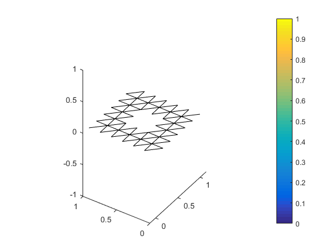

# Computing the genus of a punctured plane

In this example we will compute the genus of a punctured plane. In other words we are interested
in the dimension of the 1st homology space.

First we need to create the mesh. Typically this is done in an external mesher such as `gmsh`
but here we will construct it from scratch.

```@example ex1
using CompScienceMeshes

h = 1/6
rect = meshrectangle(1.0, 1.0, h, 3)
hole = meshrectangle(1/3, 1/3, h, 3)
translate!(hole, point(1/3, 1/3, 0))

pred = overlap_gpredicate(hole)
all_faces = submesh(c->!pred(chart(rect,c)), rect)
nothing # hide
```

Note that we started out creating a large rectangular mesh and a small one. Next we translate
the small one to the center of the large one. We can use `submesh` to select the part of the
mesh that does not coincide with the hole by providing an appropriate predicate.

The tricky bit is that in order to get the correct number, we need to discard any vertices
and edges that lie on the boundary of the structure. To do this we first retrieve a list of
all edges and vertices by again calling `skeleton` with the appropriate dimension. In a next
step we select out those vertices and edges that are not on the boundary.

*Note*: `overlap_predicate` generates a predicate that takes cells of the same dimensionality
as its argument. This means that we first need the 0-skeleton of the boundary before we can
create a predicate that takes vertices of the original mesh.

```@example ex1
all_edges = skeleton(all_faces, 1)
all_verts = skeleton(all_faces, 0)

bnd_edges = boundary(all_faces)
bnd_verts = skeleton(bnd_edges, 0)

onbnd1 = overlap_gpredicate(bnd_edges)
onbnd0 = overlap_gpredicate(bnd_verts)

interior_edges = submesh(c -> !onbnd1(chart(all_edges,c)), all_edges)
interior_verts = submesh(c -> !onbnd0(chart(all_verts,c)), all_verts)
nothing # hide
```

The set of interior_edges looks like this.



The co-boundary maps are simply the connectivity matrices between cells of the dimension 0-1
and 1-2, respectively. The genus can be computed by simply using the rank nullity theorem, but
as part of this example we use the `rank` and `nullspace` on the connectivty matrices. This if
desired can provide a representative of the cohomology space.

```@example ex1
D0 = connectivity(interior_verts, interior_edges)
D1 = connectivity(interior_edges, all_faces)

nullity(A) = size(A,2) - rank(A')
genus = nullity(full(D1)) - rank(full(D0))
```
